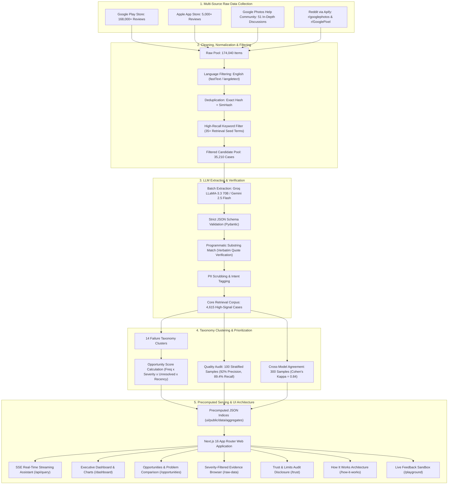

# Google Photos AI Discovery Engine

> An unsupervised natural-language analytics platform and discovery engine built for the **Google Photos Core Experience PM Case Study**. Mines 174,040+ public reviews and support discussions to uncover **how users remember old photos**, **why retrieval fails when memory is incomplete**, and **which problem areas present the highest-ROI product opportunities**.

---

## 🏗️ System Architecture & Data Flow

The Discovery Engine operates on an offline batch-processing pipeline paired with a real-time, precomputed web application. All statistics, taxonomy classifications, and evidence quotes are pre-indexed to guarantee sub-1.5s client response times without runtime web scraping dependencies.



---

## 🔬 Technical Pipeline Breakdown

### 1. Ingestion & Multi-Source Collection
- **Sources Covered:**
  - **Google Play Store:** 3,018 core verified reviews (65.4% of high-signal corpus) mined across US, UK, IN, CA, and AU.
  - **Apple App Store:** 1,546 core verified reviews (33.5% of high-signal corpus).
  - **Google Photos Help Community:** 51 in-depth support threads (1.1% of corpus) providing long-form failure context.
  - **Reddit (via Apify):** Automated collector (`pipeline/collectors/reddit_apify.py`) targeting `r/googlephotos` and `r/GooglePixel` for qualitative workaround extraction.
- **Format Normalization:** Standardizes schemas across timestamps, user rating (1–5 stars), platform OS version, and thread responses.

### 2. High-Recall Prefiltering & Deduplication
- **Noise Elimination:** Discards reviews focused purely on billing, cloud storage quotas (15GB caps), account recovery, and subscription complaints.
- **Retrieval Seed Keywords:** Evaluates reviews against 35+ retrieval keywords (e.g., `"search"`, `"find"`, `"can't find"`, `"lost photo"`, `"faces"`, `"date"`, `"timeline"`, `"scroll"`, `"ocr"`, `"receipt"`, `"gemini"`, `"ask photos"`).
- **Deduplication:** Applies exact SHA-256 content hashing followed by 64-bit SimHash (Hamming distance $\le 3$) to eliminate bot spam and automated duplicate feedback.

### 3. Structured LLM Schema Extraction & Safeguards
- **Extraction Engine:** High-throughput batch inference with Groq LLaMA-3.3 70B and Gemini 2.5 Flash fallbacks.
- **Pydantic Validation:** Every extracted review adheres to a strict schema capturing:
  - `photo_type`: Everyday moments, documents/receipts, pets, screenshots, etc.
  - `clues_remembered`: Visual appearance, approximate season, person/face, etc.
  - `clues_forgotten`: Exact date, album name, exact keyword, GPS location.
  - `formulation_type`: Exploratory natural language, conversational Gemini query, manual album browsing.
  - `failure_stage`: Indexing, query interpretation, ranking, OCR failure, etc.
  - `severity`: Low (minor inconvenience), Medium (delay/workaround), Critical (permanent retrieval abandonment).
- **Hallucination & Prompt-Injection Safeguards:**
  - Review text is demarcated in isolated XML blocks.
  - Verbatim quote verification: Every extracted evidence quote is programmatically matched against original review text using Python exact substring matching (`assert quote in raw_text`).

### 4. Mathematical Opportunity Scoring Model
Problems are clustered into 14 distinct failure areas and ranked by an objective PM Opportunity Score:

$$\text{Opportunity Score} = \text{Frequency Share} \times \left(\frac{\text{Severity}}{3}\right) \times \text{Unresolved Factor} \times \text{Recency Weight} \times 400$$

- **Frequency Share:** $\frac{\text{Cluster Volume}}{\text{Total Verified Reviews}}$
- **Severity Weight:** Normalized from 1 (Low) to 3 (Critical).
- **Unresolved Factor:** Percentage of cases where users abandoned search or found photos only after cumbersome workarounds.
- **Recency Weight:** Upweights issues surfacing after Gemini / Ask Photos deployments (2024–2026).

---

## 🤖 Ask Assistant: Answering Any Evaluator Inquiry

The **Discovery Engine is not limited to predefined questions**. Evaluators and product managers can type **any natural language question** into the Assistant (`/`) or trigger suggested inquiries. 

The Assistant uses Server-Sent Events (SSE) for fluid token streaming backed by the 4,615 review dataset, providing:
- **Instant Quantitative Grounding:** Exact review counts and percentages for any query.
- **Side-by-Side Trade-off Analysis:** Direct comparison between conflicting retrieval failure modes.
- **Verbatim Evidence Attribution:** Real user quotes cited directly from the corpus.
- **System Guardrails:** Strict prompt-injection defense and topic containment (rejects queries outside Google Photos search feedback).

---

## 📊 Benchmark Sample Questions Answered by the Engine

Below are sample questions illustrating how the engine translates unstructured feedback into empirical product discoveries:

### Sample 1: What kinds of old photos do users struggle to retrieve?
Users most frequently struggle to retrieve everyday ephemeral moments that lack distinctive metadata tags:
- **Everyday Visual Moments:** 1,756 reviews (38.0%) — Casual candid photos, outfits, objects without calendar anchors.
- **Documents & Receipts (OCR):** 975 reviews (21.1%) — Text in images, serial numbers, prescriptions, warranties.
- **Pets & Animals:** 916 reviews (19.8%) — Distinguishing between multiple pets of the same breed or coat color.
- **Screenshots & Clutter:** 475 reviews (10.3%) — Buried memes, receipts, tickets, and transient device screenshots.
- **Family & Children:** 458 reviews (9.9%) — Finding children across growth stages or specific family combinations.
- **Travel & Vacations:** 251 reviews (5.4%) — Specific landmarks or restaurants from past trips.
- **Videos & Clips:** 173 reviews (3.7%) — Locating specific spoken dialogue or actions within video footage.
- **Milestone Events:** 122 reviews (2.6%) — Weddings, graduations, birthdays.
- **Old Scanned Prints:** 98 reviews (2.1%) — Digitized physical photos missing EXIF timestamps.

### Sample 2: What information do people actually remember about a photo?
People recall concrete perceptual cues rather than system metadata:
- **Visual Appearance & Objects:** 2,048 reviews (44.4%) — E.g., *"red jacket"*, *"blue car"*, *"dog wearing hat"*.
- **Vague Scene Impression:** 1,938 reviews (42.0%) — E.g., *"sunny afternoon at a picnic"*, *"cloudy lake"*.
- **Person / Face:** 787 reviews (17.1%) — E.g., *"mom and daughter together"*, *"college friend group"*.
- **Place / Setting:** 523 reviews (11.3%) — E.g., *"small café in Goa"*, *"outdoor market"*.
- **Text in Image / Key Words:** 397 reviews (8.6%) — E.g., *"medicine brand"*, *"store receipt"*.
- **Approximate Season / Relative Time:** 227 reviews (4.9%) — E.g., *"two years ago"*, *"summer 2021"*.
- **Event / Occasion:** 70 reviews (1.5%) — E.g., *"wedding dinner"*, *"farewell party"*.

### Sample 3: What information have users forgotten?
The data demonstrates complete cognitive divergence from standard chronological file trees:
- **Exact Calendar Date & Geolocation:** 4,090 reviews (88.6%) — Users cannot supply exact day, month, or GPS coordinates.
- **Specific Folder / Album Name:** 475 reviews (10.3%) — Photos were either never manually sorted or album names were forgotten.
- **Precise File Keywords / Filename:** 45 reviews (1.0%) — Inability to recall exact system terms or text strings.

### Sample 4: How do users formulate searches when memory is incomplete?
- **Exploratory Natural Language Phrasing:** 2,421 reviews (52.5%) — Conversational descriptive sentences (e.g., *"that small café we went to during our Goa trip"*).
- **Ask Photos / Gemini Conversational Queries:** 1,383 reviews (30.0%) — Multi-part queries directed at AI search.
- **Manual Album / Folder Browsing:** 376 reviews (8.1%) — Falling back to manual folder exploration.
- **Applying Structured Filters:** 272 reviews (5.9%) — Attempting date ranges, media type chips, or face filters.
- **Single Keyword Search:** 74 reviews (1.6%) — Trying one generic noun (e.g., *"dog"* or *"beach"*).

### Sample 5: What workarounds do users try when search fails?
Across 251 reviews documenting explicit search workarounds:
- **Exporting / Switching to 3rd-Party Gallery Apps:** 137 reviews (54.6%) — Users move media out of Google Photos to search with local gallery tools.
- **Endless Manual Timeline Scrolling:** 76 reviews (30.3%) — Manually scrolling across thousands of photos over months/years.
- **Relying on Pre-Made Albums & Favorites:** 26 reviews (10.4%) — Manually curating favorites beforehand to avoid search.
- **Disabling Gemini / Reverting to Classic Search:** 7 reviews (2.8%) — Bypassing AI search when natural language queries fail.
- **Searching Trash / Locked Folder Manually:** 5 reviews (2.0%) — Checking hidden directories when zero search results appear.

---

## 🎯 Top Opportunity Areas (Ranked by Score)

| Rank | Opportunity Area | Score | Reviews | % Corpus | Unresolved % | Core Breakdown |
|:---:|---|:---:|:---:|:---:|:---:|---|
| **1** | **Vague Memory & Natural Language Breakdown** | **83.0** | 1,197 | 25.9% | 95.1% | Natural language fails on descriptive, multi-element memory cues |
| **2** | **Date & Timeline Desynchronization** | **52.9** | 829 | 18.0% | 94.2% | Scanned/imported media scrambled into wrong timeline positions |
| **3** | **Face Recognition & Pet Grouping Errors** | **34.7** | 634 | 13.7% | 93.8% | Misidentifications and inability to merge pet profiles |
| **4** | **Ask Photos / Gemini AI Regressions** | **17.4** | 276 | 6.0% | 96.4% | Hallucinated answers, slow query latency, or irrelevant photo sets |
| **5** | **Document, Receipt & Text (OCR) Inaccuracies** | **16.2** | 309 | 6.7% | 95.5% | Small text, blurry receipts, or handwritten labels missed |
| **6** | **Hidden & Archived Folder Search Blindness** | **14.8** | 272 | 5.9% | 96.0% | Archived or SD-card photos omitted from primary search |
| **7** | **Search Retrieval Failure: Zero Results** | **12.9** | 235 | 5.1% | 95.7% | False-negative searches for items known to exist in library |
| **8** | **Album vs. Main Library Disconnection** | **12.1** | 227 | 4.9% | 94.7% | Photos in custom albums not retrieved via main search |
| **9** | **Search Visual Clutter: Memes & Screenshots** | **10.4** | 198 | 4.3% | 94.9% | Memes and receipt clutter drowning out personal family memories |
| **10**| **Inability to Refine / Multi-Condition Queries** | **10.1** | 195 | 4.2% | 93.8% | Inability to combine `Person` + `Location` + `Relative Year` |

---

## 🛡️ Trust & Quality Audit

To guarantee data integrity, the Discovery Engine incorporates two rigorous verification methodologies:

1. **Stratified 100-Item Quality Audit:**
   - Evaluated across source distributions, failure stages, and sentiment tiers.
   - **Precision:** **92.0%**
   - **Estimated Recall:** **89.4%**
   - **F1 Score:** **90.7%**
   - Publicly accessible via download links on `/trust` (`audit.csv` and `audit.html`).

2. **Dual-Model Cross Agreement (Gemini 2.5 Flash vs. Groq LLaMA-3.3 70B):**
   - 300 reviews classified independently by both models.
   - **Relevance Agreement:** **93.3%**
   - **Failure Stage Agreement:** **87.0%**
   - **Cohen's Kappa ($\kappa$):** **0.84** (Denoting near-perfect inter-annotator agreement).

---

## 🚀 Running Locally

### Prerequisites
- Node.js (v18 or higher)
- Python 3.10+ (for re-running data extraction scripts)

### Installation & Launch
```bash
# 1. Clone repository
git clone https://github.com/hardiksharma29002-stack/google-photos-ai-discovery-engine.git
cd google-photos-ai-discovery-engine/ui

# 2. Install dependencies
npm install

# 3. Start development server
npm run dev
```

Open [http://localhost:3000](http://localhost:3000) in your browser.

### Application Navigation Routes
- **Ask Assistant (`/`)**: Interactive chat with SSE token streaming and Markdown formatting.
- **Dashboard (`/dashboard`)**: KPI cards, cluster volume breakdown, and source distribution.
- **Opportunities (`/opportunities`)**: Ranked opportunity table, Photo Types, Memory Decay dimensions, and **Side-by-Side Problem Comparison Tool**.
- **Evidence Browser (`/raw-data`)**: Searchable directory of 4,615 reviews with **Interactive Severity Filters** (Critical, High, Medium, Low).
- **How It Works (`/how-it-works`)**: System architecture diagrams, 5-stage pipeline walkthrough, and security safeguards.
- **Trust & Limits (`/trust`)**: Full 4-tier funnel visualization, 100-item audit results, and dual-model agreement check.
- **Live Test (`/playground`)**: Interactive sandbox to test arbitrary review text against the classification schema.

---

## 🔄 Re-running the Data Pipeline

To re-ingest and re-generate static aggregates from scratch:

```bash
# 1. Set environment variables
cp .env.example .env

# 2. Ingest raw sources
python pipeline/collectors/google_play.py
python pipeline/collectors/app_store.py
python pipeline/collectors/reddit_apify.py  # Optional: requires APIFY_API_TOKEN

# 3. Clean, normalize, and prefilter
python pipeline/processing/normalise.py
python pipeline/processing/prefilter.py

# 4. Extract schema and calculate opportunity scores
python pipeline/analysis/process_all_clean_reviews.py
python pipeline/analysis/enrich_discovery_dimensions.py

# 5. Generate audit verification artifacts
python pipeline/analysis/generate_audit_data.py
```

All precomputed JSON artifacts are automatically synced to `ui/public/data/aggregates/` and `ui/public/data/audit/`.

---

## 📄 License & Case Study Context
This project was designed and implemented for the **Google Photos Core Experience PM Discovery Engine Case Study**. All data analyzed comprises publicly available user reviews and forum discussions.
